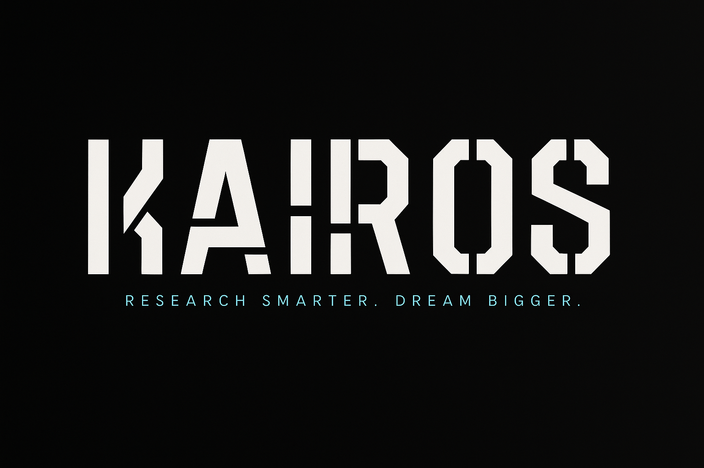
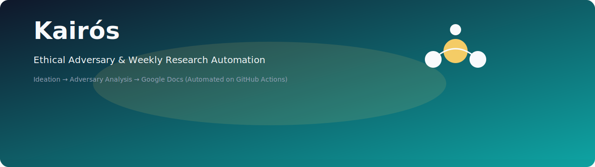
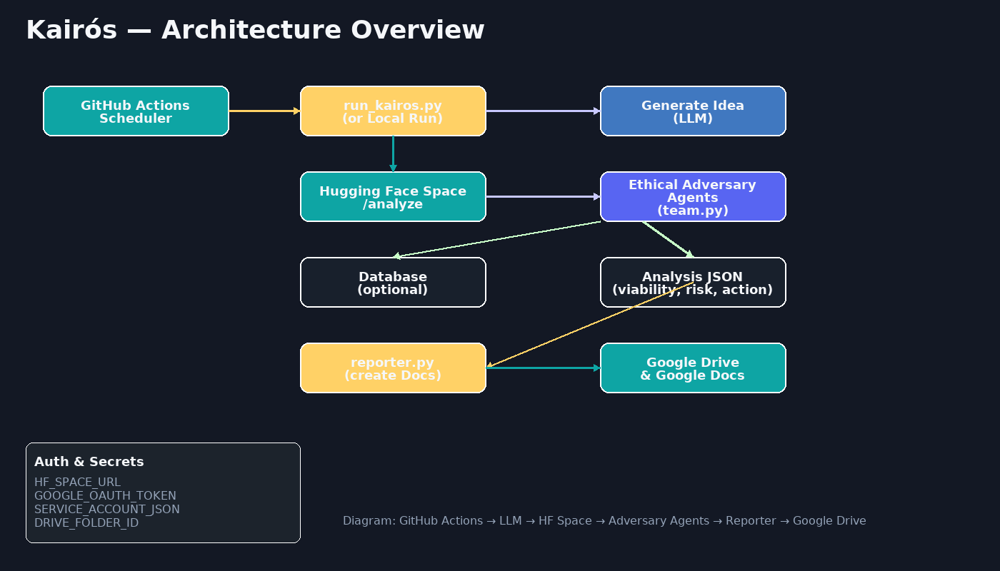

  

<h1 align="center">🌌 Project KAIROS</h1>

<i>🚀 Research Smarter. Dream Bigger.</i>

---

  

  
  
  
  
  

---

## 🌟 What is Kairos?

    Kairos is your personal automated AI assistant 🤖 that helps you research, analyze, and explore startup ideas faster.
    It combines AI reasoning, Hugging Face Spaces, and GitHub Actions automation to create reports 📑 and insights 🔍 — without you lifting a finger.

## 🏗️ Architecture

Here’s how Kairos works under the hood:

## ⚡ Quick Start

    1️⃣ Deploy API on Hugging Face Spaces
    ➡️ Hugging Face Repo: https://huggingface.co/spaces/Aryan-2511/ethical-adversary-api/tree/main

    2️⃣ Clone the GitHub Repo
    ➡️ GitHub Repo: https://github.com/Aryan-2511/Project-Kairos

    3️⃣ Set up Automation with GitHub Actions

    Auto-schedules runs every Monday & Thursday ⏰

    Creates Google Docs reports 📊 with your research

## 🎨 Visuals

    📅 Automation Cycle
    ✔️ Every Monday → Generate fresh startup insights
    ✔️ Every Thursday → Deep-dive follow-ups
    ✔️ Anytime → Manual run from GitHub Actions

## 💡 Why Kairos?

    🧠 AI-first approach → Smarter research, faster decisions

    ⚡ Hands-free automation → Weekly reports without manual effort

    🌐 Seamless integration → Hugging Face + GitHub Actions + Google Drive

    🚀 Built for innovators → Focus on execution, not research busywork

## 📌 Roadmap

    ✔️ Idea generation automation

    ✔️ Ethical adversary critique

    ✔️ Google Docs integration

    ✔️ GitHub Actions scheduling

    ⏳ Dashboard for visualization

    ⏳ Multi-topic parallel runs

## 🤝 Contributing

    Contributions are welcome! 🎉

## 👨‍💻 Author

    Made with ❤️ by Aryan

    GitHub: Aryan-2511

    Hugging Face: Aryan-2511

✨ With KAIROS, you don’t just research ideas…
You research smarter. You dream bigger.